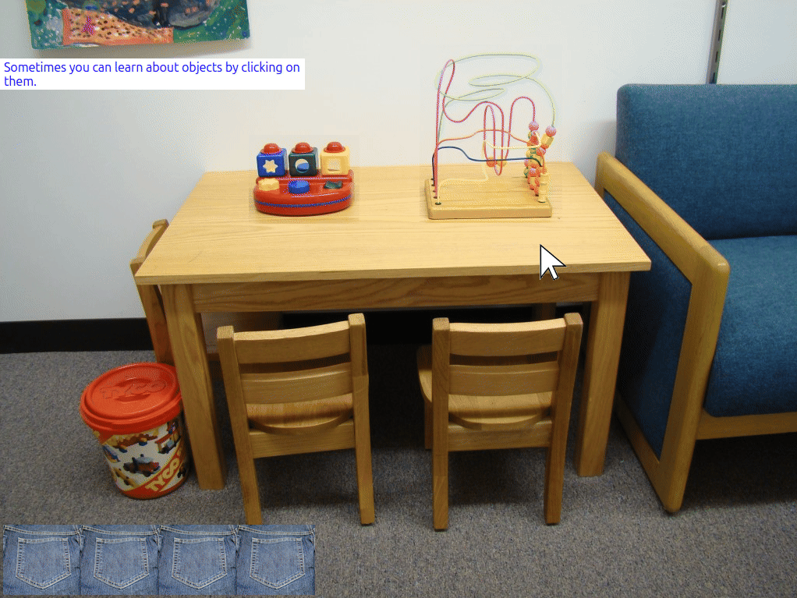

# GEMSrun -- Graphical Environment Management System Runner

**Author:** Travis L. Seymour, PhD
**License:** GPLv3
**Python:** 3.11 -- 3.14

## Overview

GEMSrun is a desktop application for running interactive virtual environments built on the GEMS (Graphical Environment Management System) framework. GEMS environments are composed of interconnected views (scenes depicted by static images), interactive objects within those views, and a flexible event system of triggers, conditions, and actions that govern user interactions. GEMS was inspired by the 1993 adventure videogame [Myst](https://en.wikipedia.org/wiki/Myst) by Rand and Robyn Miller of Broderbund Software.

> Note: GEMSrun is meant to be used in conjunction with [GEMSedit](https://www.github.com/travisseymour/GEMSedit), which must be installed separately. GEMSedit is the companion authoring tool used to create and edit the environment files that GEMSrun executes.

### GEMS Run Snapshot

[](gemsrun/resources/gifs/gemsrun_pocket_object.gif)

## Features

- **View Rendering** -- Display environments composed of layered foreground, background, and overlay images with automatic letterboxing.
- **Interactive Objects** -- Click, drag, and interact with rectangular regions within views, each with configurable visibility, draggability, and takeability.
- **Action System** -- Execute actions triggered by mouse clicks, key presses, timers, and drag-and-drop interactions. Supports 27 action types including navigation, media playback, variable management, text display, and more.
- **Condition Evaluation** -- Gate action execution with 13 condition types including variable checks, elapsed time, keyboard buffer contents, and object/pocket state.
- **Timed Triggers** -- Automatically fire actions based on time spent in a view or total elapsed time.
- **Pockets / Inventory** -- Allow users to pick up objects and carry them between views using up to 10 configurable pocket slots with drag-and-drop support.
- **Audio Playback** -- Play sound effects and background music (MP3, OGG, WAV, FLAC) with volume control, looping, and async playback via pygame-ce.
- **Video Playback** -- Play video files with positioning, volume, looping, and duration control.
- **Text-to-Speech** -- Speak text aloud using Google TTS with automatic caching and pre-rendering.
- **Text Overlays** -- Display styled text boxes and HTML-formatted messages, plus modal dialogs and user input prompts.
- **View Transitions** -- Configurable transition animations (fade/dissolve, wipe-left, wipe-right, instant) with adjustable duration.
- **Navigation Controls** -- Directional navigation panel with customizable graphics and portal-based view jumping.
- **Data Recording** -- Log all user and system events with timestamps to structured data files for analysis.
- **Debug Mode** -- Color-coded console logging, a real-time info window showing environment/view/variable state, and object hover effects.
- **Display Modes** -- Run environments in windowed, maximized, or fullscreen mode.
- **Audio Caching** -- Automatic conversion and caching of audio files for faster subsequent loads.
- **Cross-Platform** -- Runs on Linux, macOS, and Windows.

## Installation

GEMSrun is distributed as a Python package and is best installed using [UV](https://docs.astral.sh/uv/), a fast Python package and project manager.

### Installing UV

UV is the recommended tool for installing and managing GEMSrun. Install it by following the instructions at [https://docs.astral.sh/uv/getting-started/installation/](https://docs.astral.sh/uv/getting-started/installation/).

For example, on Linux or macOS:

```bash
curl -LsSf https://astral.sh/uv/install.sh | sh
```

On Windows:

```powershell
powershell -ExecutionPolicy ByPass -c "irm https://astral.sh/uv/install.ps1 | iex"
```

### Installing GEMSrun

Once UV is installed, install GEMSrun as a tool:

```bash
uv tool install GEMSrun
```

This makes the `gemsrun` (or `GEMSrun`) command available system-wide.

**Notes for Linux users:**

If you encounter a PySide6 xcb plugin error, install the required system library:

```bash
sudo apt install libxcb-cursor0
```

If sound isn't working on Linux, try this:

```bash
sudo dnf install gstreamer1 gstreamer1-plugins-base gstreamer1-plugins-good \
                 gstreamer1-plugins-bad-free gstreamer1-plugins-bad-freeworld \
                 gstreamer1-plugins-ugly gstreamer1-libav
```

### Updating GEMSrun

To update to the latest version:

```bash
uv tool upgrade GEMSrun
```

### Uninstalling GEMSrun

To remove GEMSrun:

```bash
uv tool uninstall GEMSrun
```

## Usage

Launch the runner from the command line:

```bash
gemsrun
```

This opens the parameter dialog where you can select an environment file and configure launch options.

### Command-Line Options

GEMSrun can also be launched with command-line arguments to skip the parameter dialog:

```bash
gemsrun [ENVIRONMENT_FILE] [USER_ID] [OPTIONS]
```

| Option             | Description                                   |
| ------------------ | --------------------------------------------- |
| `-f, --file`       | Path to the GEMS environment `.yaml` file     |
| `-u, --user`       | User ID for data logging                      |
| `-s, --skipdata`   | Suppress data file output                     |
| `-o, --overwrite`  | Allow overwriting duplicate data files        |
| `-d, --debug`      | Enable debug mode with console output         |
| `-k, --skipmedia`  | Disable audio and video playback              |
| `-g, --skipgui`    | Skip the parameter dialog (requires all args) |
| `-F, --fullscreen` | Launch in fullscreen mode                     |

To clear the audio cache:

```bash
gemsrun clear-cache
```

A debug-specific entry point is also available that always outputs to the console:

```bash
gemsrun_debug
```

### Opening an Environment

1. Click the **Browse** button in the parameter dialog (or use the recent environments dropdown).
2. Navigate to an environment folder and select its `.yaml` database file.
3. Configure launch options (user ID, data recording, display mode, debug mode, media playback).
4. Click **Start** to launch the environment.

### Running an Environment

Once launched, the environment displays the start view and responds to user interaction:

- Click on objects to trigger their associated actions.
- Drag objects into pocket slots to pick them up and carry them between views.
- Use the navigation panel arrows or keyboard to move between views.
- Type on the keyboard to fill the key buffer (used by keyboard-based conditions and actions).

### Debug Info Window

When running in debug mode (non-fullscreen), press **Ctrl+Shift+I** to toggle the info window, which displays:

- **Environment tab** -- Global options, view/object/action counts, and settings.
- **View tab** -- Current view properties, all objects with their states, and the keyboard buffer.
- **Variables tab** -- All environment variables with their current values, updated in real time.

### Exiting an Environment

- Press **Escape** or close the window to stop the environment.
- Press **Ctrl+Shift+X** to force an immediate exit (logged in the data file).

## Environment Structure

A GEMS environment consists of:

- A database file (`.yaml`) containing all views, objects, actions, and settings.
- A media folder (`<envname>_media/`) containing all image and audio assets.

Both are stored in a single project directory and are all that is needed to share or relocate an environment.

## Data Output

When data recording is enabled, GEMSrun writes a timestamped log file to `~/Documents/GEMS/Data/`. Each entry records the event type, current view, elapsed time, and action-specific details. These files can be used for analyzing user behavior and interactions within the environment.
